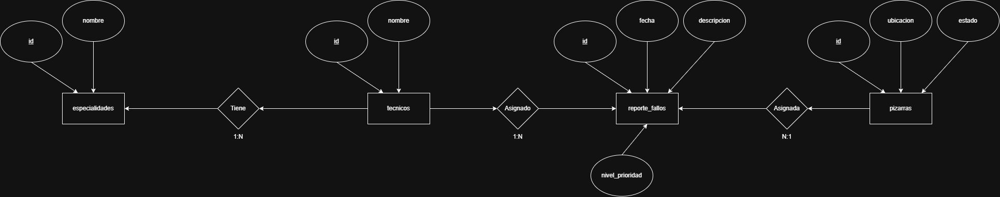

# Corto 1 - Plataforma de Base de Datos

Implementación de una plataforma de datos sobre PostgreSQL para la gestión de mantenimiento técnico y reportes de fallos, con despliegue reproducible mediante Docker Compose.

## Resumen ejecutivo

Este proyecto provee un entorno listo para uso académico y demostrativo, incluyendo:

- Motor PostgreSQL 17 para almacenamiento transaccional.
- Interfaz administrativa pgAdmin.
- Scripts SQL versionados para definición de esquema, integridad, optimización, automatización y consulta.

La inicialización está centralizada en `sql-init/main.sql`, lo que permite una puesta en marcha consistente y controlada.

## Alcance funcional

- Modelado de entidades de mantenimiento: pizarras, técnicos, especialidades y reportes.
- Reglas de integridad referencial y restricciones de negocio.
- Automatización por trigger para cambio de estado.
- Índices para optimización de consulta.
- Vista consolidada para consulta operativa de reportes.

## Arquitectura de servicios

| Servicio | Contenedor | Imagen | Puerto host | Credenciales |
|---|---|---|---:|---|
| PostgreSQL | `postgresdb` | `postgres:17.2` | `5434` | Usuario: `postgres` / Clave: `admin123` |
| pgAdmin | `pgadmin1` | `dpage/pgadmin4` | `5050` | Usuario: `admin@admin.com` / Clave: `admin123` |

## Requisitos

- Docker Desktop o Docker Engine + Docker Compose.
- Git.

## Estructura del repositorio

```text
corto_1/
|-- docker-compose.yml
|-- README.md
|-- img/
|   `-- corto_1.png
`-- sql-init/
    |-- main.sql
    |-- V1_20260323_create_table_pizarras.sql
    |-- V1_20260323_create_constraint_ck_pizarras_estado.sql
    |-- V1_20260323_create_table_especialidades.sql
    |-- V1_20260323_create_table_tecnicos.sql
    |-- V1_20260323_create_table_reporte_fallos.sql
    |-- V1_20260323_create_reference_pizarra_reporte.sql
    |-- V1_20260323_create_reference_tecnico_reporte.sql
    |-- V1_20260323_create_trigger_cambio_estado.sql
    |-- V1_20260323_create_constraint_ck_limite.sql
    |-- V1_20260323_create_index_fecha_reportes.sql
    |-- V1_20260323_create_index_tecnico_reportes.sql
    |-- V1_20260323_create_analyze_reporte_fallos.sql
    |-- V1_20260323_create_comments.sql
    |-- V1_20260324_insert_data.sql
    `-- V1_20260324_create_view_ver_reportes.sql
```

## Inicio rápido

### 1. Levantar el entorno

```bash
docker compose up -d
```

### 2. Validar disponibilidad de contenedores

```bash
docker ps
```

### 3. Reejecutar la inicialización de base de datos (opcional)

```bash
docker exec -it postgresdb psql -U postgres -d midb -f /docker-entrypoint-initdb.d/main.sql
```

## Mapa de scripts por módulo

### Módulo 1. Creación de objetos e integridad

- `V1_20260323_create_table_pizarras.sql`
- `V1_20260323_create_constraint_ck_pizarras_estado.sql`
- `V1_20260323_create_table_especialidades.sql`
- `V1_20260323_create_table_tecnicos.sql`
- `V1_20260323_create_table_reporte_fallos.sql`
- `V1_20260323_create_reference_pizarra_reporte.sql`
- `V1_20260323_create_reference_tecnico_reporte.sql`
- `V1_20260323_create_trigger_cambio_estado.sql`

### Módulo 2. Evolución y optimización

- `V1_20260323_create_constraint_ck_limite.sql`
- `V1_20260323_create_index_fecha_reportes.sql`
- `V1_20260323_create_index_tecnico_reportes.sql`

### Módulo 3. Mantenimiento

- `V1_20260323_create_analyze_reporte_fallos.sql`

### Módulo 4. Documentación de metadatos

- `V1_20260323_create_comments.sql`

### Datos y capa de consulta

- `V1_20260324_insert_data.sql`
- `V1_20260324_create_view_ver_reportes.sql`

## Validación funcional mínima

### Inserción de reporte para activar trigger

```sql
INSERT INTO reporte_fallos (descripcion, pizarra_id, tecnico_id, nivel_prioridad)
VALUES ('No enciende la pantalla interactiva', 1, 1, 5);
```

### Consulta de vista consolidada

```sql
SELECT *
FROM ver_reportes;
```

## Operación y soporte

### Reinicializar entorno de datos

```bash
docker compose down -v
docker compose up -d
```

### Revisar registros del motor PostgreSQL

```bash
docker logs postgresdb
```

## Modelo entidad-relación



## Nota técnica

En términos prácticos:

- Los índices reducen el costo de búsqueda en columnas frecuentes de filtrado.
- `ANALYZE` actualiza estadísticas para que el optimizador estime mejor cuántas filas devolverá una consulta.

## Integrantes

- Eliseo Antonio Santos Diaz
- Edras Ariel Viera Lazo

